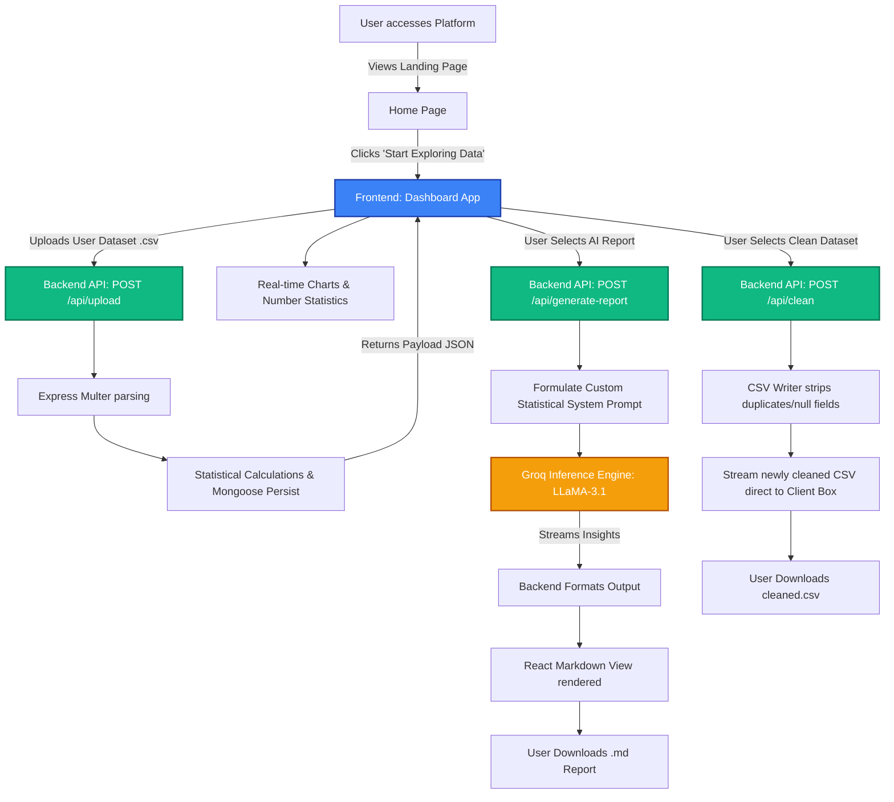

# 📊 Sales & Reviews Insights (Data Explorer Platform)


A powerful, production-ready Full-Stack MERN application designed for exploring CSV datasets, extracting statistical insights, visualizing data metrics, cleaning messy data, and creating beautiful Analyst-grade text reports using Groq’s high-speed AI models.

## 🌟 Key Features

- **📂 Seamless CSV Parsing:** Drag and drop large CSV datasets and instantly calculate total rows, duplicate counts, missing percentages, numeric fields, categorical fields, and outlier counts.
- **📈 Interactive Data Visualizations:** Real-time generation of Bar Charts (Recharts) automatically detecting your numeric and categorical column distributions.
- **🧹 Intelligent Data Cleaner:** Click a single button to strip out entirely empty rows and identical duplicate records from your CSV memory, streaming the freshly cleaned file right back as an instant download.
- **🤖 Groq AI Analyst Reporter:** Connect your dataset’s mathematical breakdown to the ultra-fast LLaMA-3.1 model running on Groq hardware. Receives instant markdown-formatted analytical reports summarizing insights, trends, data health, and clear next steps, with the ability to download the markdown report cleanly.
- **🏠 Modern Landing Page:** Beautiful intuitive UI featuring interactive background shapes, rich icons (Lucide-React), and glassmorphism cards. Starts the journey before moving into the core Data Explorer Dashboard. 
- **💾 Secured Analytical History:** Persist previous CSV summaries inside an optimized MongoDB server.
- **🔐 Production Prepared Structure:** Pre-configured with automatic CORS enforcement, rate limiters, strict data body size controls up to 50MB for heavy spreadsheets, and automated server deletion for uploaded temp files.

---

## 🏗️ Technical Architecture & Block Diagram



## 🛠️ Stack Components

**Frontend (Client)**
- **React.js** (Functional Components + Hooks)
- **Tailwind CSS + Tailwind Typography Plugin** (Rapid styling + Markdown Beautification)
- **Lucide-React** (Scalable vector icons)
- **Recharts** (High-performance declarative charting library)
- **React-Markdown** (Rendering LLM streams easily)
- **Axios** (API requests)

**Backend (Server)**
- **Node.js + Express.js** (Handles up to 50mb body parsing size limits and REST endpoints)
- **MongoDB + Mongoose** (NoSQL Database structure for analysis history validation)
- **Multer** (Multiform data extraction specifically capturing CSV file uploads safely)
- **Groq SDK** (Direct fast gateway connection for LLaMA3.1-8b-instant inference)
- **CSV-Writer & CSV-Parser** (For cleaning tools and extraction pipeline)

## ⚡ Getting Started (Running Locally)

### 1. Requirements:
- Node.js (v16+)
- MongoDB Atlas Cluster or Local Instance
- Groq API Key (Sign up and get an API key via [Groq Platform](https://console.groq.com/))

### 2. Configure Environment Variables
Inside the `server/` directory, create a `.env` file with the following variables:
```env
PORT=5000
MONGODB_URI=your_mongodb_connection_string
CLIENT_URL=http://localhost:3000
GROQ_API_KEY=your_groq_api_key
```

### 3. Install & Boot Everything
Open two separate terminals for the frontend and backend. 

**Terminal 1 (Backend Server)**
```bash
cd server
npm install
npm run dev
```

**Terminal 2 (Frontend Client)**
```bash
cd client
npm install
npm run dev
```

The app will become available at `http://localhost:3000`.

## 📌 Usage Flow
1. **Initialize**: See the feature offerings on the new Landing Page and hit 'Start Exploring Data'
2. **Dropzone**: You may drag any CSV file into the Dropzone box, limited to appropriate dataset boundaries. 
3. **Analyze OR Clean**: 
   - Hover the file. You can choose to just click the "Clean Data" button to instantly receive the duplicate-free & empty row-free data download.
   - OR click "Analyze" to push data to the metrics processor.
4. **Insights**: Scroll down seeing Recharts visual maps.
5. **AI Prompting**: Click "Generate Groq AI Report" to hit the LLaMA model. Within seconds, copy or download your tailored data scientist analysis text file.

## 🤝 Project Notes
Built to scale effectively, utilizing fast inference limits securely without blocking single-threaded API requests. Contains `.gitignore` restrictions for privacy-first environments.
